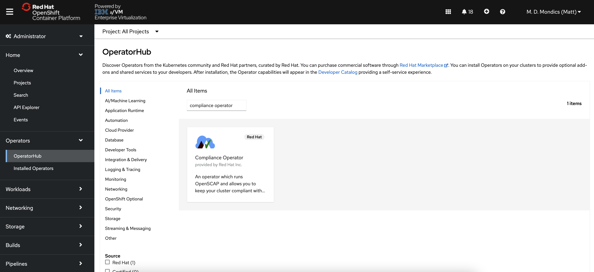
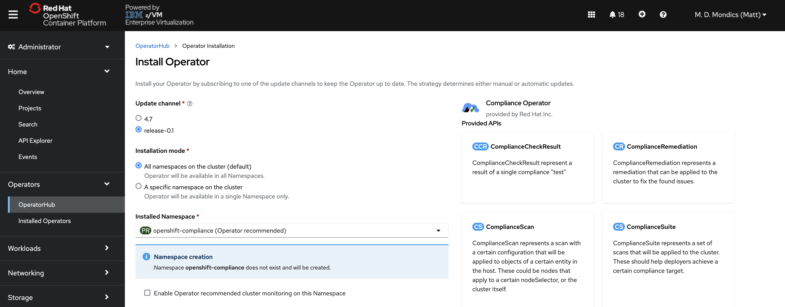
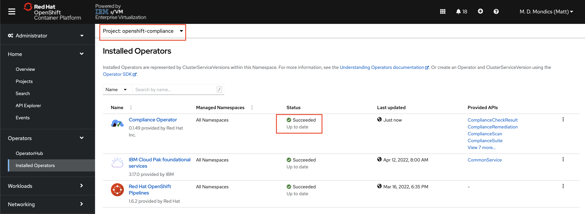
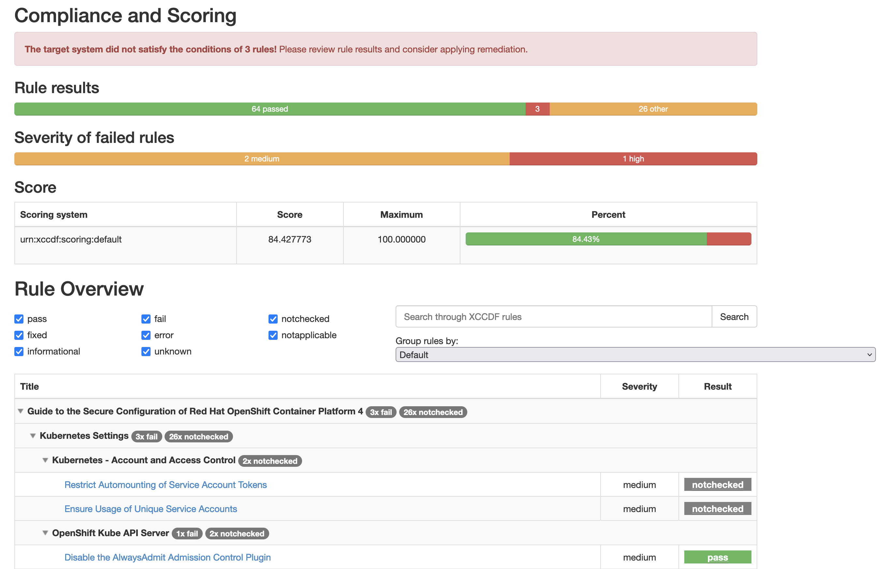

# OpenShift Compliance Operator on IBM Z and LinuxONE
 
The [Compliance Operator](https://docs.openshift.com/container-platform/4.10/security/compliance_operator/compliance-operator-release-notes.html) lets OpenShift Container Platform administrators describe the required compliance state of a cluster and provides them with an overview of gaps and ways to remediate them.

As of OpenShift version 4.10, the Compliance Operator is [supported on IBM Z and LinuxONE clusters](https://access.redhat.com/errata/RHBA-2022:1148).

Most of the contents of this repository are pulled directly from the [Compliance Operator documentation](https://docs.openshift.com/container-platform/4.10/security/compliance_operator/compliance-operator-understanding.html) along with some information and instruction from [this blog](https://blog.stderr.at/compliance/2021/07/compliance-operator/).

## Table of Contents

- [OpenShift Compliance Operator on IBM Z and LinuxONE](#openshift-compliance-operator-on-ibm-z-and-linuxone)
  - [Table of Contents](#table-of-contents)
  - [Prerequisites](#prerequisites)
  - [Understanding the Compliance Operator](#understanding-the-compliance-operator)
  - [Installing the Compliance Operator](#installing-the-compliance-operator)
  - [Running a Compliance Scan](#running-a-compliance-scan)
  - [Retreiving Scan Results](#retreiving-scan-results)
  - [Working with Scan Results](#working-with-scan-results)
  - [Remediating issues with the Compliance Operator](#remediating-issues-with-the-compliance-operator)
  - [Additional and Advanced Compliance Operator Tasks](#additional-and-advanced-compliance-operator-tasks)
  - [More Resources](#more-resources)

## Prerequisites

1. OpenShift 4.10+ on IBM Z or LinuxONE
1. Cluster administrator privileges
1. `oc compliance` binary [installed](https://docs.openshift.com/container-platform/4.10/security/compliance_operator/oc-compliance-plug-in-using.html#installing-oc-compliance_oc-compliance-plug-in-understanding)
1. The ability to move an application from a remote server to your local workstation using a tool such as `rsync`, `scp`, or an FTP application like [FileZilla](https://filezilla-project.org/)

## Understanding the Compliance Operator

The Compliance Operator lets OpenShift Container Platform administrators describe the required compliance state of a cluster and provides them with an overview of gaps and ways to remediate them. The Compliance Operator assesses compliance of both the Kubernetes API resources of OpenShift Container Platform, as well as the nodes running the cluster. The Compliance Operator uses [OpenSCAP](https://www.open-scap.org/), a NIST-certified tool, to scan and enforce security policies provided by the content.

The Compliance Operator comes with several compliance profiles which represent different compliance benchmarks. For example, the `ocp4-cis` profile represents the Center for Internet Security (CIS) benchmark for Red Hat OpenShift 4.x. 

1. **View all available compliance profiles**:

    `oc get profiles.compliance -n openshift-compliance`

    ```text
    NAME            AGE
    ocp4-cis        4d10h
    ocp4-cis-node   4d10h
    ```

    *Note: At the time of writing this documentation, `ocp4-cis` and `ocp4-cis-node` are the two supported compliance profiles for IBM Z and LinuxONE.*
    
    You can look at the details for the compliance profiles to see which rules will be checked.

1. **Look at the `ocp4-cis` compliance profile in more detail**:

    `oc get profiles.compliance -n openshift-compliance -o yaml`

    <details>
        <summary>Click to expand</summary>

    ```yaml
    apiVersion: v1
    items:
    - apiVersion: compliance.openshift.io/v1alpha1
    description: This profile defines a baseline that aligns to the Center for Internet
        Security® Red Hat OpenShift Container Platform 4 Benchmark™, V1.1. This profile
        includes Center for Internet Security® Red Hat OpenShift Container Platform 4
        CIS Benchmarks™ content. Note that this part of the profile is meant to run on
        the Platform that Red Hat OpenShift Container Platform 4 runs on top of. This
        profile is applicable to OpenShift versions 4.6 and greater.
    id: xccdf_org.ssgproject.content_profile_cis
    kind: Profile
    metadata:
        annotations:
        compliance.openshift.io/image-digest: pb-ocp4d4cmw
        compliance.openshift.io/product: redhat_openshift_container_platform_4.1
        compliance.openshift.io/product-type: Platform
        creationTimestamp: "2022-04-28T03:32:06Z"
        generation: 1
        labels:
        compliance.openshift.io/profile-bundle: ocp4
        name: ocp4-cis
        namespace: openshift-compliance
        ownerReferences:
        - apiVersion: compliance.openshift.io/v1alpha1
        blockOwnerDeletion: true
        controller: true
        kind: ProfileBundle
        name: ocp4
        uid: 47202940-2f43-46e4-9a7a-4b6accee4e3f
        resourceVersion: "559508505"
        uid: 5dc364b8-aa7f-409b-9b8b-655a5ada986a
    rules:
    - ocp4-accounts-restrict-service-account-tokens
    - ocp4-accounts-unique-service-account
    - ocp4-api-server-admission-control-plugin-alwaysadmit
    - ocp4-api-server-admission-control-plugin-alwayspullimages
    - ocp4-api-server-admission-control-plugin-namespacelifecycle
    - ocp4-api-server-admission-control-plugin-noderestriction
    - ocp4-api-server-admission-control-plugin-scc
    - ocp4-api-server-admission-control-plugin-securitycontextdeny
    - ocp4-api-server-admission-control-plugin-serviceaccount
    - ocp4-api-server-anonymous-auth
    - ocp4-api-server-api-priority-flowschema-catch-all
    - ocp4-api-server-api-priority-gate-enabled
    - ocp4-api-server-api-priority-v1alpha1-flowschema-catch-all
    - ocp4-api-server-audit-log-maxbackup
    - ocp4-api-server-audit-log-maxsize
    - ocp4-api-server-audit-log-path
    - ocp4-api-server-auth-mode-no-aa
    - ocp4-api-server-auth-mode-node
    - ocp4-api-server-auth-mode-rbac
    - ocp4-api-server-basic-auth
    - ocp4-api-server-bind-address
    - ocp4-api-server-client-ca
    - ocp4-api-server-encryption-provider-cipher
    - ocp4-api-server-encryption-provider-config
    - ocp4-api-server-etcd-ca
    - ocp4-api-server-etcd-cert
    - ocp4-api-server-etcd-key
    - ocp4-api-server-https-for-kubelet-conn
    - ocp4-api-server-insecure-bind-address
    - ocp4-api-server-insecure-port
    - ocp4-api-server-kubelet-certificate-authority
    - ocp4-api-server-kubelet-client-cert
    - ocp4-api-server-kubelet-client-key
    - ocp4-api-server-no-adm-ctrl-plugins-disabled
    - ocp4-api-server-oauth-https-serving-cert
    - ocp4-api-server-openshift-https-serving-cert
    - ocp4-api-server-profiling-protected-by-rbac
    - ocp4-api-server-request-timeout
    - ocp4-api-server-service-account-lookup
    - ocp4-api-server-service-account-public-key
    - ocp4-api-server-tls-cert
    - ocp4-api-server-tls-cipher-suites
    - ocp4-api-server-tls-private-key
    - ocp4-api-server-token-auth
    - ocp4-audit-log-forwarding-enabled
    - ocp4-audit-profile-set
    - ocp4-configure-network-policies
    - ocp4-configure-network-policies-namespaces
    - ocp4-controller-insecure-port-disabled
    - ocp4-controller-rotate-kubelet-server-certs
    - ocp4-controller-secure-port
    - ocp4-controller-service-account-ca
    - ocp4-controller-service-account-private-key
    - ocp4-controller-use-service-account
    - ocp4-etcd-auto-tls
    - ocp4-etcd-cert-file
    - ocp4-etcd-client-cert-auth
    - ocp4-etcd-key-file
    - ocp4-etcd-peer-auto-tls
    - ocp4-etcd-peer-cert-file
    - ocp4-etcd-peer-client-cert-auth
    - ocp4-etcd-peer-key-file
    - ocp4-file-groupowner-proxy-kubeconfig
    - ocp4-file-owner-proxy-kubeconfig
    - ocp4-file-permissions-proxy-kubeconfig
    - ocp4-general-apply-scc
    - ocp4-general-configure-imagepolicywebhook
    - ocp4-general-default-namespace-use
    - ocp4-general-default-seccomp-profile
    - ocp4-general-namespaces-in-use
    - ocp4-idp-is-configured
    - ocp4-kubeadmin-removed
    - ocp4-kubelet-configure-tls-cert
    - ocp4-kubelet-configure-tls-key
    - ocp4-kubelet-disable-readonly-port
    - ocp4-ocp-api-server-audit-log-maxbackup
    - ocp4-ocp-api-server-audit-log-maxsize
    - ocp4-openshift-api-server-audit-log-path
    - ocp4-rbac-debug-role-protects-pprof
    - ocp4-rbac-limit-cluster-admin
    - ocp4-rbac-limit-secrets-access
    - ocp4-rbac-pod-creation-access
    - ocp4-rbac-wildcard-use
    - ocp4-scc-drop-container-capabilities
    - ocp4-scc-limit-container-allowed-capabilities
    - ocp4-scc-limit-ipc-namespace
    - ocp4-scc-limit-net-raw-capability
    - ocp4-scc-limit-network-namespace
    - ocp4-scc-limit-privilege-escalation
    - ocp4-scc-limit-privileged-containers
    - ocp4-scc-limit-process-id-namespace
    - ocp4-scc-limit-root-containers
    - ocp4-scheduler-no-bind-address
    - ocp4-secrets-consider-external-storage
    - ocp4-secrets-no-environment-variables
    title: CIS Red Hat OpenShift Container Platform 4 Benchmark
    - apiVersion: compliance.openshift.io/v1alpha1
    description: This profile defines a baseline that aligns to the Center for Internet
        Security® Red Hat OpenShift Container Platform 4 Benchmark™, V1.1. This profile
        includes Center for Internet Security® Red Hat OpenShift Container Platform 4
        CIS Benchmarks™ content. Note that this part of the profile is meant to run on
        the Operating System that Red Hat OpenShift Container Platform 4 runs on top of.
        This profile is applicable to OpenShift versions 4.6 and greater.
    id: xccdf_org.ssgproject.content_profile_cis-node
    kind: Profile
    metadata:
        annotations:
        compliance.openshift.io/image-digest: pb-ocp4d4cmw
        compliance.openshift.io/product: redhat_openshift_container_platform_node_4
        compliance.openshift.io/product-type: Node
        creationTimestamp: "2022-04-28T03:32:05Z"
        generation: 1
        labels:
        compliance.openshift.io/profile-bundle: ocp4
        name: ocp4-cis-node
        namespace: openshift-compliance
        ownerReferences:
        - apiVersion: compliance.openshift.io/v1alpha1
        blockOwnerDeletion: true
        controller: true
        kind: ProfileBundle
        name: ocp4
        uid: 47202940-2f43-46e4-9a7a-4b6accee4e3f
        resourceVersion: "559508492"
        uid: 32fe0ef5-2258-47ba-bbfb-d12d103e3077
    rules:
    - ocp4-etcd-unique-ca
    - ocp4-file-groupowner-cni-conf
    - ocp4-file-groupowner-controller-manager-kubeconfig
    - ocp4-file-groupowner-etcd-data-dir
    - ocp4-file-groupowner-etcd-data-files
    - ocp4-file-groupowner-etcd-member
    - ocp4-file-groupowner-etcd-pki-cert-files
    - ocp4-file-groupowner-ip-allocations
    - ocp4-file-groupowner-kube-apiserver
    - ocp4-file-groupowner-kube-controller-manager
    - ocp4-file-groupowner-kube-scheduler
    - ocp4-file-groupowner-kubelet-conf
    - ocp4-file-groupowner-master-admin-kubeconfigs
    - ocp4-file-groupowner-multus-conf
    - ocp4-file-groupowner-openshift-pki-cert-files
    - ocp4-file-groupowner-openshift-pki-key-files
    - ocp4-file-groupowner-openshift-sdn-cniserver-config
    - ocp4-file-groupowner-ovs-conf-db
    - ocp4-file-groupowner-ovs-conf-db-lock
    - ocp4-file-groupowner-ovs-pid
    - ocp4-file-groupowner-ovs-sys-id-conf
    - ocp4-file-groupowner-ovs-vswitchd-pid
    - ocp4-file-groupowner-ovsdb-server-pid
    - ocp4-file-groupowner-scheduler-kubeconfig
    - ocp4-file-groupowner-worker-ca
    - ocp4-file-groupowner-worker-kubeconfig
    - ocp4-file-groupowner-worker-service
    - ocp4-file-owner-cni-conf
    - ocp4-file-owner-controller-manager-kubeconfig
    - ocp4-file-owner-etcd-data-dir
    - ocp4-file-owner-etcd-data-files
    - ocp4-file-owner-etcd-member
    - ocp4-file-owner-etcd-pki-cert-files
    - ocp4-file-owner-ip-allocations
    - ocp4-file-owner-kube-apiserver
    - ocp4-file-owner-kube-controller-manager
    - ocp4-file-owner-kube-scheduler
    - ocp4-file-owner-kubelet
    - ocp4-file-owner-kubelet-conf
    - ocp4-file-owner-master-admin-kubeconfigs
    - ocp4-file-owner-multus-conf
    - ocp4-file-owner-openshift-pki-cert-files
    - ocp4-file-owner-openshift-pki-key-files
    - ocp4-file-owner-openshift-sdn-cniserver-config
    - ocp4-file-owner-ovs-conf-db
    - ocp4-file-owner-ovs-conf-db-lock
    - ocp4-file-owner-ovs-pid
    - ocp4-file-owner-ovs-sys-id-conf
    - ocp4-file-owner-ovs-vswitchd-pid
    - ocp4-file-owner-ovsdb-server-pid
    - ocp4-file-owner-scheduler-kubeconfig
    - ocp4-file-owner-worker-ca
    - ocp4-file-owner-worker-kubeconfig
    - ocp4-file-owner-worker-service
    - ocp4-file-permissions-cni-conf
    - ocp4-file-permissions-controller-manager-kubeconfig
    - ocp4-file-permissions-etcd-data-dir
    - ocp4-file-permissions-etcd-data-files
    - ocp4-file-permissions-etcd-member
    - ocp4-file-permissions-etcd-pki-cert-files
    - ocp4-file-permissions-ip-allocations
    - ocp4-file-permissions-kube-apiserver
    - ocp4-file-permissions-kube-controller-manager
    - ocp4-file-permissions-kubelet-conf
    - ocp4-file-permissions-master-admin-kubeconfigs
    - ocp4-file-permissions-multus-conf
    - ocp4-file-permissions-openshift-pki-cert-files
    - ocp4-file-permissions-openshift-pki-key-files
    - ocp4-file-permissions-ovs-conf-db
    - ocp4-file-permissions-ovs-conf-db-lock
    - ocp4-file-permissions-ovs-pid
    - ocp4-file-permissions-ovs-sys-id-conf
    - ocp4-file-permissions-ovs-vswitchd-pid
    - ocp4-file-permissions-ovsdb-server-pid
    - ocp4-file-permissions-scheduler
    - ocp4-file-permissions-scheduler-kubeconfig
    - ocp4-file-permissions-worker-ca
    - ocp4-file-permissions-worker-kubeconfig
    - ocp4-file-permissions-worker-service
    - ocp4-file-perms-openshift-sdn-cniserver-config
    - ocp4-kubelet-anonymous-auth
    - ocp4-kubelet-authorization-mode
    - ocp4-kubelet-configure-client-ca
    - ocp4-kubelet-configure-event-creation
    - ocp4-kubelet-configure-tls-cipher-suites
    - ocp4-kubelet-enable-cert-rotation
    - ocp4-kubelet-enable-client-cert-rotation
    - ocp4-kubelet-enable-iptables-util-chains
    - ocp4-kubelet-enable-protect-kernel-defaults
    - ocp4-kubelet-enable-protect-kernel-sysctl
    - ocp4-kubelet-enable-server-cert-rotation
    - ocp4-kubelet-enable-streaming-connections
    - ocp4-kubelet-eviction-thresholds-set-hard-imagefs-available
    - ocp4-kubelet-eviction-thresholds-set-hard-imagefs-inodesfree
    - ocp4-kubelet-eviction-thresholds-set-hard-memory-available
    - ocp4-kubelet-eviction-thresholds-set-hard-nodefs-available
    - ocp4-kubelet-eviction-thresholds-set-hard-nodefs-inodesfree
    - ocp4-kubelet-eviction-thresholds-set-soft-imagefs-available
    - ocp4-kubelet-eviction-thresholds-set-soft-imagefs-inodesfree
    - ocp4-kubelet-eviction-thresholds-set-soft-memory-available
    - ocp4-kubelet-eviction-thresholds-set-soft-nodefs-available
    - ocp4-kubelet-eviction-thresholds-set-soft-nodefs-inodesfree
    title: CIS Red Hat OpenShift Container Platform 4 Benchmark
    kind: List
    metadata:
    resourceVersion: ""
    selfLink: ""
    ```
    </details>

    You can see the list of rules included in the `ocp4-cis` compliance profile. To look at one specific rule, you can do so.

1. **Look at the `ocp4-accounts-restrict-service-account-tokens` rule in more detail:**

    `oc get rules.compliance ocp4-accounts-restrict-service-account-tokens -n openshift-compliance -o yaml`

    ```yaml
    apiVersion: compliance.openshift.io/v1alpha1
    description: Service accounts tokens should not be mounted in pods except where the
    workload running in the pod explicitly needs to communicate with the API server.
    To ensure pods do not automatically mount tokens, set automountServiceAccountToken
    to false.
    id: xccdf_org.ssgproject.content_rule_accounts_restrict_service_account_tokens
    instructions: |-
    For each pod in the cluster, review the pod specification and
    ensure that pods that do not need to explicitly communicate with
    the API server have automountServiceAccountToken
    configured to false.
    kind: Rule
    metadata:
    annotations:
        compliance.openshift.io/image-digest: pb-ocp4d4cmw
        compliance.openshift.io/rule: accounts-restrict-service-account-tokens
        control.compliance.openshift.io/CIS-OCP: 5.1.6
        control.compliance.openshift.io/NERC-CIP: CIP-003-8 R6;CIP-004-6 R3;CIP-007-3
        R6.1
        control.compliance.openshift.io/NIST-800-53: CM-6;CM-6(1)
        control.compliance.openshift.io/PCI-DSS: Req-2.2
        policies.open-cluster-management.io/controls: 5.1.6,CIP-003-8 R6,CIP-004-6 R3,CIP-007-3
        R6.1,CM-6,CM-6(1),Req-2.2
        policies.open-cluster-management.io/standards: CIS-OCP,NERC-CIP,NIST-800-53,PCI-DSS
    creationTimestamp: "2022-04-28T03:32:06Z"
    generation: 1
    labels:
        compliance.openshift.io/profile-bundle: ocp4
    name: ocp4-accounts-restrict-service-account-tokens
    namespace: openshift-compliance
    ownerReferences:
    - apiVersion: compliance.openshift.io/v1alpha1
        blockOwnerDeletion: true
        controller: true
        kind: ProfileBundle
        name: ocp4
        uid: 47202940-2f43-46e4-9a7a-4b6accee4e3f
    resourceVersion: "559508524"
    uid: 37849c3f-7bcc-4fb7-8c94-e9bea5bd8c96
    rationale: Mounting service account tokens inside pods can provide an avenue for privilege escalation attacks where an attacker is able to compromise a single pod in the cluster.
    severity: medium
    title: Restrict Automounting of Service Account Tokens
    ```

## Installing the Compliance Operator

These instructions are taken from the official [Red Hat OpenShift documentation](https://docs.openshift.com/container-platform/4.10/security/compliance_operator/compliance-operator-installation.html#installing-compliance-operator-web-console_compliance-operator-installation).

1. **In the OpenShift Container Platform web console, navigate to Operators → OperatorHub.**
1. **Search for the Compliance Operator, click its tile, then click Install.**

    

1. **Keep the default selection of Installation mode and namespace to ensure that the Operator will be installed to the openshift-compliance namespace.**

    

1. **Click Install.**

To confirm that the installation is successful:

1. **Navigate to the Operators → Installed Operators.**
1. **Check that the Compliance Operator is installed in the openshift-compliance namespace and its status is Succeeded.**

    

If the Operator is not installed successfully:

1. **Navigate to the Operators → Installed Operators page and inspect the Status column for any errors or failures.**
1. **Navigate to the Workloads → Pods page and check the logs in any pods in the openshift-compliance project that are reporting issues.**

## Running a Compliance Scan

The Compliance Operator creates a CustomResourceDefinition in the cluster called a ScanSetting which stores configuration information about compliance scans. The Compliance Operator also creates a few starter ScanSettings, including one named `default` that has some reasonable parameters defined or can be modified to suit the requirements of different organizations.

1. **View the `default` ScanSetting:**

    ```bash
    oc get scansetting default -n openshift-compliance -o yaml
    ```

    Example output:

    ```yaml
    apiVersion: compliance.openshift.io/v1alpha1
    kind: ScanSetting
    metadata:
    name: default
    namespace: openshift-compliance
    rawResultStorage:
    pvAccessModes:
    - ReadWriteOnce 
    rotation: 3 
    size: 1Gi 
    roles:
    - worker 
    - master 
    scanTolerations: 
    default:
    - operator: Exists
    schedule: 0 1 * * * 
    ```

    This ScanSetting tells the Compliance Operator to store the results of three compliance scans in a persistent volume with the size of `1 Gi` and `ReadWriteOnce` access mode. The `.roles` section tells the Compliance Operator which node types to scan if nodes are covered by the profile that will be used. Lastly, the `.scanTolerations.schedule` parameter tells the Compliance Operator when to run. In the screenshot above, the scan will run every day at 01:00.

    With the ScanSetting defined, you will want to create a ScanSettingBinding that binds to it and defines the profiles that will be scanned against.

1. **Create a file named `ssc-cis.yaml` and insert the following contents:**

    ```yaml
    apiVersion: compliance.openshift.io/v1alpha1
    kind: ScanSettingBinding
    metadata:
    name: cis-compliance
    namespace: openshift-compliance
    profiles:
    - name: ocp4-cis-node
        kind: Profile
        apiGroup: compliance.openshift.io/v1alpha1
    - name: ocp4-cis
        kind: Profile
        apiGroup: compliance.openshift.io/v1alpha1
    settingsRef:
    name: default
    kind: ScanSetting
    apiGroup: compliance.openshift.io/v1alpha1
    ```

    Creating this ScanSettingBinding will initiate a compliance scan using the `ocp4-cis-node` and `ocp4-cis` profiles and the default ScanSetting you looked at above.

1. **Start a compliance scan by creating the ScanSettingBinding:**

    `oc create -f ssb-cis.yaml -n openshift-compliance`

    Creating the ScanSettingBinding automatically generates three ComplianceScan objects that correspond to the profiles in the ScanSetting, one for the overall cluster, one for the control plane nodes, and one for the compute nodes.

    The ComplianceScan objects will progress until they reach the `DONE` phase.

1. **Check the status of the ComplianceScans:**

    `oc get compliancescan -n openshift-compliance`

    ```text
    NAME                   PHASE       RESULT
    ocp4-cis               LAUNCHING   NOT-AVAILABLE
    ocp4-cis-node-master   LAUNCHING   NOT-AVAILABLE
    ocp4-cis-node-worker   LAUNCHING   NOT-AVAILABLE
    ```

    You can run this `oc get` command periodically to check the status. Alternatively, you can add the `-w` flag to *watch* the objects as they progress through the phases.

    `oc get compliancescan -n openshift-compliance -w`

    ```text
    NAME                   PHASE         RESULT
    ocp4-cis               RUNNING       NOT-AVAILABLE
    ocp4-cis-node-master   RUNNING       NOT-AVAILABLE
    ocp4-cis-node-worker   RUNNING       NOT-AVAILABLE
    ocp4-cis-node-worker   AGGREGATING   NOT-AVAILABLE
    ocp4-cis-node-master   AGGREGATING   NOT-AVAILABLE
    ocp4-cis               AGGREGATING   NOT-AVAILABLE
    ocp4-cis               AGGREGATING   NOT-AVAILABLE
    ocp4-cis-node-worker   DONE          NON-COMPLIANT
    ocp4-cis               DONE          NON-COMPLIANT
    ocp4-cis-node-master   DONE          INCONSISTENT
    ```

    Once you see a `DONE` phase for each of the three ComplianceScans, the scans are completed and you can break out of the command you're watching. 

    You will notice that the results for each scan are likely `NON-COMPLIANT` or `INCONSISTENT`. The next step is to dig into which of the policy rules were not met, why they were not met, and which ones are able to be remediated automatically.

## Retreiving Scan Results

1. **List the results for each policy rule that was checked:**

    `oc get compliancecheckresults -n openshift-compliance`

    <details>
        <summary>Click to expand</summary>

    ```text
    NAME                                                                           STATUS         SEVERITY
    ocp4-cis-accounts-restrict-service-account-tokens                              MANUAL         medium
    ocp4-cis-accounts-unique-service-account                                       MANUAL         medium
    ocp4-cis-api-server-admission-control-plugin-alwaysadmit                       PASS           medium
    ocp4-cis-api-server-admission-control-plugin-alwayspullimages                  PASS           high
    ocp4-cis-api-server-admission-control-plugin-namespacelifecycle                PASS           medium
    ocp4-cis-api-server-admission-control-plugin-noderestriction                   PASS           medium
    ocp4-cis-api-server-admission-control-plugin-scc                               PASS           medium
    ocp4-cis-api-server-admission-control-plugin-securitycontextdeny               PASS           medium
    ocp4-cis-api-server-admission-control-plugin-serviceaccount                    PASS           medium
    ocp4-cis-api-server-anonymous-auth                                             PASS           medium
    ocp4-cis-api-server-api-priority-gate-enabled                                  PASS           medium
    ocp4-cis-api-server-audit-log-maxbackup                                        PASS           low
    ocp4-cis-api-server-audit-log-maxsize                                          PASS           medium
    ocp4-cis-api-server-audit-log-path                                             PASS           high
    ocp4-cis-api-server-auth-mode-no-aa                                            PASS           medium
    ocp4-cis-api-server-auth-mode-node                                             PASS           medium
    ocp4-cis-api-server-auth-mode-rbac                                             PASS           medium
    ocp4-cis-api-server-basic-auth                                                 PASS           medium
    ocp4-cis-api-server-bind-address                                               PASS           low
    ocp4-cis-api-server-client-ca                                                  PASS           medium
    ocp4-cis-api-server-encryption-provider-cipher                                 PASS           medium
    ocp4-cis-api-server-encryption-provider-config                                 PASS           medium
    ocp4-cis-api-server-etcd-ca                                                    PASS           medium
    ocp4-cis-api-server-etcd-cert                                                  PASS           medium
    ocp4-cis-api-server-etcd-key                                                   PASS           medium
    ocp4-cis-api-server-https-for-kubelet-conn                                     PASS           medium
    ocp4-cis-api-server-insecure-bind-address                                      PASS           medium
    ocp4-cis-api-server-insecure-port                                              PASS           medium
    ocp4-cis-api-server-kubelet-certificate-authority                              PASS           high
    ocp4-cis-api-server-kubelet-client-cert                                        PASS           high
    ocp4-cis-api-server-kubelet-client-key                                         PASS           high
    ocp4-cis-api-server-no-adm-ctrl-plugins-disabled                               PASS           medium
    ocp4-cis-api-server-oauth-https-serving-cert                                   MANUAL         medium
    ocp4-cis-api-server-openshift-https-serving-cert                               MANUAL         medium
    ocp4-cis-api-server-profiling-protected-by-rbac                                PASS           medium
    ocp4-cis-api-server-request-timeout                                            PASS           medium
    ocp4-cis-api-server-service-account-lookup                                     PASS           medium
    ocp4-cis-api-server-service-account-public-key                                 PASS           medium
    ocp4-cis-api-server-tls-cert                                                   PASS           medium
    ocp4-cis-api-server-tls-cipher-suites                                          PASS           medium
    ocp4-cis-api-server-tls-private-key                                            PASS           medium
    ocp4-cis-api-server-token-auth                                                 PASS           high
    ocp4-cis-audit-log-forwarding-enabled                                          FAIL           medium
    ocp4-cis-audit-profile-set                                                     PASS           medium
    ocp4-cis-configure-network-policies                                            MANUAL         high
    ocp4-cis-configure-network-policies-namespaces                                 FAIL           high
    ocp4-cis-controller-insecure-port-disabled                                     PASS           low
    ocp4-cis-controller-rotate-kubelet-server-certs                                PASS           medium
    ocp4-cis-controller-secure-port                                                PASS           low
    ocp4-cis-controller-service-account-ca                                         PASS           medium
    ocp4-cis-controller-service-account-private-key                                PASS           medium
    ocp4-cis-controller-use-service-account                                        PASS           medium
    ocp4-cis-etcd-auto-tls                                                         PASS           medium
    ocp4-cis-etcd-cert-file                                                        PASS           medium
    ocp4-cis-etcd-client-cert-auth                                                 PASS           medium
    ocp4-cis-etcd-key-file                                                         PASS           medium
    ocp4-cis-etcd-peer-auto-tls                                                    PASS           medium
    ocp4-cis-etcd-peer-cert-file                                                   PASS           medium
    ocp4-cis-etcd-peer-client-cert-auth                                            PASS           medium
    ocp4-cis-etcd-peer-key-file                                                    PASS           medium
    ocp4-cis-file-groupowner-proxy-kubeconfig                                      MANUAL         medium
    ocp4-cis-file-owner-proxy-kubeconfig                                           MANUAL         medium
    ocp4-cis-file-permissions-proxy-kubeconfig                                     PASS           medium
    ocp4-cis-general-apply-scc                                                     MANUAL         medium
    ocp4-cis-general-configure-imagepolicywebhook                                  MANUAL         medium
    ocp4-cis-general-default-namespace-use                                         MANUAL         medium
    ocp4-cis-general-default-seccomp-profile                                       MANUAL         medium
    ocp4-cis-general-namespaces-in-use                                             MANUAL         medium
    ocp4-cis-idp-is-configured                                                     PASS           medium
    ocp4-cis-kubeadmin-removed                                                     PASS           medium
    ocp4-cis-kubelet-configure-tls-cert                                            PASS           medium
    ocp4-cis-kubelet-configure-tls-key                                             PASS           medium
    ocp4-cis-kubelet-disable-readonly-port                                         PASS           medium
    ocp4-cis-node-master-etcd-unique-ca                                            PASS           medium
    ocp4-cis-node-master-file-groupowner-cni-conf                                  PASS           medium
    ocp4-cis-node-master-file-groupowner-controller-manager-kubeconfig             PASS           medium
    ocp4-cis-node-master-file-groupowner-etcd-data-dir                             PASS           medium
    ocp4-cis-node-master-file-groupowner-etcd-data-files                           PASS           medium
    ocp4-cis-node-master-file-groupowner-etcd-member                               PASS           medium
    ocp4-cis-node-master-file-groupowner-etcd-pki-cert-files                       PASS           medium
    ocp4-cis-node-master-file-groupowner-ip-allocations                            PASS           medium
    ocp4-cis-node-master-file-groupowner-kube-apiserver                            PASS           medium
    ocp4-cis-node-master-file-groupowner-kube-controller-manager                   PASS           medium
    ocp4-cis-node-master-file-groupowner-kube-scheduler                            PASS           medium
    ocp4-cis-node-master-file-groupowner-kubelet-conf                              PASS           medium
    ocp4-cis-node-master-file-groupowner-master-admin-kubeconfigs                  PASS           medium
    ocp4-cis-node-master-file-groupowner-multus-conf                               PASS           medium
    ocp4-cis-node-master-file-groupowner-openshift-pki-cert-files                  PASS           medium
    ocp4-cis-node-master-file-groupowner-openshift-pki-key-files                   PASS           medium
    ocp4-cis-node-master-file-groupowner-openshift-sdn-cniserver-config            PASS           medium
    ocp4-cis-node-master-file-groupowner-ovs-conf-db                               FAIL           medium
    ocp4-cis-node-master-file-groupowner-ovs-conf-db-lock                          FAIL           medium
    ocp4-cis-node-master-file-groupowner-ovs-pid                                   PASS           medium
    ocp4-cis-node-master-file-groupowner-ovs-sys-id-conf                           FAIL           medium
    ocp4-cis-node-master-file-groupowner-ovs-vswitchd-pid                          PASS           medium
    ocp4-cis-node-master-file-groupowner-ovsdb-server-pid                          PASS           medium
    ocp4-cis-node-master-file-groupowner-scheduler-kubeconfig                      PASS           medium
    ocp4-cis-node-master-file-groupowner-worker-ca                                 PASS           medium
    ocp4-cis-node-master-file-groupowner-worker-kubeconfig                         PASS           medium
    ocp4-cis-node-master-file-groupowner-worker-service                            PASS           medium
    ocp4-cis-node-master-file-owner-cni-conf                                       PASS           medium
    ocp4-cis-node-master-file-owner-controller-manager-kubeconfig                  PASS           medium
    ocp4-cis-node-master-file-owner-etcd-data-dir                                  PASS           medium
    ocp4-cis-node-master-file-owner-etcd-data-files                                PASS           medium
    ocp4-cis-node-master-file-owner-etcd-member                                    PASS           medium
    ocp4-cis-node-master-file-owner-etcd-pki-cert-files                            PASS           medium
    ocp4-cis-node-master-file-owner-ip-allocations                                 PASS           medium
    ocp4-cis-node-master-file-owner-kube-apiserver                                 PASS           medium
    ocp4-cis-node-master-file-owner-kube-controller-manager                        PASS           medium
    ocp4-cis-node-master-file-owner-kube-scheduler                                 PASS           medium
    ocp4-cis-node-master-file-owner-kubelet                                        PASS           medium
    ocp4-cis-node-master-file-owner-kubelet-conf                                   PASS           medium
    ocp4-cis-node-master-file-owner-master-admin-kubeconfigs                       PASS           medium
    ocp4-cis-node-master-file-owner-multus-conf                                    PASS           medium
    ocp4-cis-node-master-file-owner-openshift-pki-cert-files                       PASS           medium
    ocp4-cis-node-master-file-owner-openshift-pki-key-files                        PASS           medium
    ocp4-cis-node-master-file-owner-openshift-sdn-cniserver-config                 PASS           medium
    ocp4-cis-node-master-file-owner-ovs-conf-db                                    PASS           medium
    ocp4-cis-node-master-file-owner-ovs-conf-db-lock                               PASS           medium
    ocp4-cis-node-master-file-owner-ovs-pid                                        PASS           medium
    ocp4-cis-node-master-file-owner-ovs-sys-id-conf                                PASS           medium
    ocp4-cis-node-master-file-owner-ovs-vswitchd-pid                               PASS           medium
    ocp4-cis-node-master-file-owner-ovsdb-server-pid                               PASS           medium
    ocp4-cis-node-master-file-owner-scheduler-kubeconfig                           PASS           medium
    ocp4-cis-node-master-file-owner-worker-ca                                      PASS           medium
    ocp4-cis-node-master-file-owner-worker-kubeconfig                              PASS           medium
    ocp4-cis-node-master-file-owner-worker-service                                 PASS           medium
    ocp4-cis-node-master-file-permissions-cni-conf                                 PASS           medium
    ocp4-cis-node-master-file-permissions-controller-manager-kubeconfig            PASS           medium
    ocp4-cis-node-master-file-permissions-etcd-data-dir                            PASS           medium
    ocp4-cis-node-master-file-permissions-etcd-data-files                          INCONSISTENT   medium
    ocp4-cis-node-master-file-permissions-etcd-member                              PASS           medium
    ocp4-cis-node-master-file-permissions-etcd-pki-cert-files                      PASS           medium
    ocp4-cis-node-master-file-permissions-ip-allocations                           PASS           medium
    ocp4-cis-node-master-file-permissions-kube-apiserver                           PASS           medium
    ocp4-cis-node-master-file-permissions-kube-controller-manager                  PASS           medium
    ocp4-cis-node-master-file-permissions-kubelet-conf                             PASS           medium
    ocp4-cis-node-master-file-permissions-master-admin-kubeconfigs                 PASS           medium
    ocp4-cis-node-master-file-permissions-multus-conf                              PASS           medium
    ocp4-cis-node-master-file-permissions-openshift-pki-cert-files                 PASS           medium
    ocp4-cis-node-master-file-permissions-openshift-pki-key-files                  PASS           medium
    ocp4-cis-node-master-file-permissions-ovs-conf-db                              PASS           medium
    ocp4-cis-node-master-file-permissions-ovs-conf-db-lock                         PASS           medium
    ocp4-cis-node-master-file-permissions-ovs-pid                                  PASS           medium
    ocp4-cis-node-master-file-permissions-ovs-sys-id-conf                          PASS           medium
    ocp4-cis-node-master-file-permissions-ovs-vswitchd-pid                         PASS           medium
    ocp4-cis-node-master-file-permissions-ovsdb-server-pid                         PASS           medium
    ocp4-cis-node-master-file-permissions-scheduler                                PASS           medium
    ocp4-cis-node-master-file-permissions-scheduler-kubeconfig                     PASS           medium
    ocp4-cis-node-master-file-permissions-worker-ca                                PASS           medium
    ocp4-cis-node-master-file-permissions-worker-kubeconfig                        PASS           medium
    ocp4-cis-node-master-file-permissions-worker-service                           PASS           medium
    ocp4-cis-node-master-file-perms-openshift-sdn-cniserver-config                 PASS           medium
    ocp4-cis-node-master-kubelet-anonymous-auth                                    PASS           medium
    ocp4-cis-node-master-kubelet-authorization-mode                                PASS           medium
    ocp4-cis-node-master-kubelet-configure-client-ca                               PASS           medium
    ocp4-cis-node-master-kubelet-configure-event-creation                          FAIL           medium
    ocp4-cis-node-master-kubelet-configure-tls-cipher-suites                       FAIL           medium
    ocp4-cis-node-master-kubelet-enable-cert-rotation                              PASS           medium
    ocp4-cis-node-master-kubelet-enable-client-cert-rotation                       PASS           medium
    ocp4-cis-node-master-kubelet-enable-iptables-util-chains                       FAIL           medium
    ocp4-cis-node-master-kubelet-enable-protect-kernel-defaults                    FAIL           medium
    ocp4-cis-node-master-kubelet-enable-protect-kernel-sysctl                      FAIL           medium
    ocp4-cis-node-master-kubelet-enable-server-cert-rotation                       PASS           medium
    ocp4-cis-node-master-kubelet-enable-streaming-connections                      PASS           medium
    ocp4-cis-node-master-kubelet-eviction-thresholds-set-hard-imagefs-available    FAIL           medium
    ocp4-cis-node-master-kubelet-eviction-thresholds-set-hard-imagefs-inodesfree   FAIL           medium
    ocp4-cis-node-master-kubelet-eviction-thresholds-set-hard-memory-available     FAIL           medium
    ocp4-cis-node-master-kubelet-eviction-thresholds-set-hard-nodefs-available     FAIL           medium
    ocp4-cis-node-master-kubelet-eviction-thresholds-set-hard-nodefs-inodesfree    FAIL           medium
    ocp4-cis-node-master-kubelet-eviction-thresholds-set-soft-imagefs-available    FAIL           medium
    ocp4-cis-node-master-kubelet-eviction-thresholds-set-soft-imagefs-inodesfree   FAIL           medium
    ocp4-cis-node-master-kubelet-eviction-thresholds-set-soft-memory-available     FAIL           medium
    ocp4-cis-node-master-kubelet-eviction-thresholds-set-soft-nodefs-available     FAIL           medium
    ocp4-cis-node-master-kubelet-eviction-thresholds-set-soft-nodefs-inodesfree    FAIL           medium
    ocp4-cis-node-worker-file-groupowner-cni-conf                                  PASS           medium
    ocp4-cis-node-worker-file-groupowner-ip-allocations                            PASS           medium
    ocp4-cis-node-worker-file-groupowner-kubelet-conf                              PASS           medium
    ocp4-cis-node-worker-file-groupowner-multus-conf                               PASS           medium
    ocp4-cis-node-worker-file-groupowner-openshift-sdn-cniserver-config            PASS           medium
    ocp4-cis-node-worker-file-groupowner-ovs-conf-db                               FAIL           medium
    ocp4-cis-node-worker-file-groupowner-ovs-conf-db-lock                          FAIL           medium
    ocp4-cis-node-worker-file-groupowner-ovs-pid                                   PASS           medium
    ocp4-cis-node-worker-file-groupowner-ovs-sys-id-conf                           FAIL           medium
    ocp4-cis-node-worker-file-groupowner-ovs-vswitchd-pid                          PASS           medium
    ocp4-cis-node-worker-file-groupowner-ovsdb-server-pid                          PASS           medium
    ocp4-cis-node-worker-file-groupowner-worker-ca                                 PASS           medium
    ocp4-cis-node-worker-file-groupowner-worker-kubeconfig                         PASS           medium
    ocp4-cis-node-worker-file-groupowner-worker-service                            PASS           medium
    ocp4-cis-node-worker-file-owner-cni-conf                                       PASS           medium
    ocp4-cis-node-worker-file-owner-ip-allocations                                 PASS           medium
    ocp4-cis-node-worker-file-owner-kubelet                                        PASS           medium
    ocp4-cis-node-worker-file-owner-kubelet-conf                                   PASS           medium
    ocp4-cis-node-worker-file-owner-multus-conf                                    PASS           medium
    ocp4-cis-node-worker-file-owner-openshift-sdn-cniserver-config                 PASS           medium
    ocp4-cis-node-worker-file-owner-ovs-conf-db                                    PASS           medium
    ocp4-cis-node-worker-file-owner-ovs-conf-db-lock                               PASS           medium
    ocp4-cis-node-worker-file-owner-ovs-pid                                        PASS           medium
    ocp4-cis-node-worker-file-owner-ovs-sys-id-conf                                PASS           medium
    ocp4-cis-node-worker-file-owner-ovs-vswitchd-pid                               PASS           medium
    ocp4-cis-node-worker-file-owner-ovsdb-server-pid                               PASS           medium
    ocp4-cis-node-worker-file-owner-worker-ca                                      PASS           medium
    ocp4-cis-node-worker-file-owner-worker-kubeconfig                              PASS           medium
    ocp4-cis-node-worker-file-owner-worker-service                                 PASS           medium
    ocp4-cis-node-worker-file-permissions-cni-conf                                 PASS           medium
    ocp4-cis-node-worker-file-permissions-ip-allocations                           PASS           medium
    ocp4-cis-node-worker-file-permissions-kubelet-conf                             PASS           medium
    ocp4-cis-node-worker-file-permissions-multus-conf                              PASS           medium
    ocp4-cis-node-worker-file-permissions-ovs-conf-db                              PASS           medium
    ocp4-cis-node-worker-file-permissions-ovs-conf-db-lock                         PASS           medium
    ocp4-cis-node-worker-file-permissions-ovs-pid                                  PASS           medium
    ocp4-cis-node-worker-file-permissions-ovs-sys-id-conf                          PASS           medium
    ocp4-cis-node-worker-file-permissions-ovs-vswitchd-pid                         PASS           medium
    ocp4-cis-node-worker-file-permissions-ovsdb-server-pid                         PASS           medium
    ocp4-cis-node-worker-file-permissions-worker-ca                                PASS           medium
    ocp4-cis-node-worker-file-permissions-worker-kubeconfig                        PASS           medium
    ocp4-cis-node-worker-file-permissions-worker-service                           PASS           medium
    ocp4-cis-node-worker-file-perms-openshift-sdn-cniserver-config                 PASS           medium
    ocp4-cis-node-worker-kubelet-anonymous-auth                                    PASS           medium
    ocp4-cis-node-worker-kubelet-authorization-mode                                PASS           medium
    ocp4-cis-node-worker-kubelet-configure-client-ca                               PASS           medium
    ocp4-cis-node-worker-kubelet-configure-event-creation                          FAIL           medium
    ocp4-cis-node-worker-kubelet-configure-tls-cipher-suites                       FAIL           medium
    ocp4-cis-node-worker-kubelet-enable-cert-rotation                              PASS           medium
    ocp4-cis-node-worker-kubelet-enable-client-cert-rotation                       PASS           medium
    ocp4-cis-node-worker-kubelet-enable-iptables-util-chains                       FAIL           medium
    ocp4-cis-node-worker-kubelet-enable-protect-kernel-defaults                    FAIL           medium
    ocp4-cis-node-worker-kubelet-enable-protect-kernel-sysctl                      FAIL           medium
    ocp4-cis-node-worker-kubelet-enable-server-cert-rotation                       PASS           medium
    ocp4-cis-node-worker-kubelet-enable-streaming-connections                      PASS           medium
    ocp4-cis-node-worker-kubelet-eviction-thresholds-set-hard-imagefs-available    FAIL           medium
    ocp4-cis-node-worker-kubelet-eviction-thresholds-set-hard-imagefs-inodesfree   FAIL           medium
    ocp4-cis-node-worker-kubelet-eviction-thresholds-set-hard-memory-available     FAIL           medium
    ocp4-cis-node-worker-kubelet-eviction-thresholds-set-hard-nodefs-available     FAIL           medium
    ocp4-cis-node-worker-kubelet-eviction-thresholds-set-hard-nodefs-inodesfree    FAIL           medium
    ocp4-cis-node-worker-kubelet-eviction-thresholds-set-soft-imagefs-available    FAIL           medium
    ocp4-cis-node-worker-kubelet-eviction-thresholds-set-soft-imagefs-inodesfree   FAIL           medium
    ocp4-cis-node-worker-kubelet-eviction-thresholds-set-soft-memory-available     FAIL           medium
    ocp4-cis-node-worker-kubelet-eviction-thresholds-set-soft-nodefs-available     FAIL           medium
    ocp4-cis-node-worker-kubelet-eviction-thresholds-set-soft-nodefs-inodesfree    FAIL           medium
    ocp4-cis-ocp-api-server-audit-log-maxbackup                                    PASS           low
    ocp4-cis-ocp-api-server-audit-log-maxsize                                      PASS           medium
    ocp4-cis-openshift-api-server-audit-log-path                                   PASS           high
    ocp4-cis-rbac-debug-role-protects-pprof                                        PASS           medium
    ocp4-cis-rbac-limit-cluster-admin                                              MANUAL         medium
    ocp4-cis-rbac-limit-secrets-access                                             MANUAL         medium
    ocp4-cis-rbac-pod-creation-access                                              MANUAL         medium
    ocp4-cis-rbac-wildcard-use                                                     MANUAL         medium
    ocp4-cis-scc-drop-container-capabilities                                       MANUAL         medium
    ocp4-cis-scc-limit-container-allowed-capabilities                              FAIL           medium
    ocp4-cis-scc-limit-ipc-namespace                                               MANUAL         medium
    ocp4-cis-scc-limit-net-raw-capability                                          MANUAL         medium
    ocp4-cis-scc-limit-network-namespace                                           MANUAL         medium
    ocp4-cis-scc-limit-privilege-escalation                                        MANUAL         medium
    ocp4-cis-scc-limit-privileged-containers                                       MANUAL         medium
    ocp4-cis-scc-limit-process-id-namespace                                        MANUAL         medium
    ocp4-cis-scc-limit-root-containers                                             MANUAL         medium
    ocp4-cis-scheduler-no-bind-address                                             PASS           medium
    ocp4-cis-secrets-consider-external-storage                                     MANUAL         medium
    ocp4-cis-secrets-no-environment-variables                                      MANUAL         medium
    ```
    </details>

1. **Narrow down this list by searching only for failed checks that can be remediated automatically:**

    `oc get compliancecheckresults -l 'compliance.openshift.io/check-status=FAIL,compliance.openshift.io/automated-remediation'`

    <details>
    <summary>Click to expand</summary>

    ```text
    NAME                                                                           STATUS   SEVERITY
    ocp4-cis-node-master-kubelet-configure-event-creation                          FAIL     medium
    ocp4-cis-node-master-kubelet-configure-tls-cipher-suites                       FAIL     medium
    ocp4-cis-node-master-kubelet-enable-iptables-util-chains                       FAIL     medium
    ocp4-cis-node-master-kubelet-enable-protect-kernel-defaults                    FAIL     medium
    ocp4-cis-node-master-kubelet-enable-protect-kernel-sysctl                      FAIL     medium
    ocp4-cis-node-master-kubelet-eviction-thresholds-set-hard-imagefs-available    FAIL     medium
    ocp4-cis-node-master-kubelet-eviction-thresholds-set-hard-imagefs-inodesfree   FAIL     medium
    ocp4-cis-node-master-kubelet-eviction-thresholds-set-hard-memory-available     FAIL     medium
    ocp4-cis-node-master-kubelet-eviction-thresholds-set-hard-nodefs-available     FAIL     medium
    ocp4-cis-node-master-kubelet-eviction-thresholds-set-hard-nodefs-inodesfree    FAIL     medium
    ocp4-cis-node-master-kubelet-eviction-thresholds-set-soft-imagefs-available    FAIL     medium
    ocp4-cis-node-master-kubelet-eviction-thresholds-set-soft-imagefs-inodesfree   FAIL     medium
    ocp4-cis-node-master-kubelet-eviction-thresholds-set-soft-memory-available     FAIL     medium
    ocp4-cis-node-master-kubelet-eviction-thresholds-set-soft-nodefs-available     FAIL     medium
    ocp4-cis-node-master-kubelet-eviction-thresholds-set-soft-nodefs-inodesfree    FAIL     medium
    ocp4-cis-node-worker-kubelet-configure-event-creation                          FAIL     medium
    ocp4-cis-node-worker-kubelet-configure-tls-cipher-suites                       FAIL     medium
    ocp4-cis-node-worker-kubelet-enable-iptables-util-chains                       FAIL     medium
    ocp4-cis-node-worker-kubelet-enable-protect-kernel-defaults                    FAIL     medium
    ocp4-cis-node-worker-kubelet-enable-protect-kernel-sysctl                      FAIL     medium
    ocp4-cis-node-worker-kubelet-eviction-thresholds-set-hard-imagefs-available    FAIL     medium
    ocp4-cis-node-worker-kubelet-eviction-thresholds-set-hard-imagefs-inodesfree   FAIL     medium
    ocp4-cis-node-worker-kubelet-eviction-thresholds-set-hard-memory-available     FAIL     medium
    ocp4-cis-node-worker-kubelet-eviction-thresholds-set-hard-nodefs-available     FAIL     medium
    ocp4-cis-node-worker-kubelet-eviction-thresholds-set-hard-nodefs-inodesfree    FAIL     medium
    ocp4-cis-node-worker-kubelet-eviction-thresholds-set-soft-imagefs-available    FAIL     medium
    ocp4-cis-node-worker-kubelet-eviction-thresholds-set-soft-imagefs-inodesfree   FAIL     medium
    ocp4-cis-node-worker-kubelet-eviction-thresholds-set-soft-memory-available     FAIL     medium
    ocp4-cis-node-worker-kubelet-eviction-thresholds-set-soft-nodefs-available     FAIL     medium
    ocp4-cis-node-worker-kubelet-eviction-thresholds-set-soft-nodefs-inodesfree    FAIL     medium    
    ```

    </details>

1. **On the other hand, narrow down the list by searching only for failed checks that must be remediated manuallly:**

    `oc get compliancecheckresults -l 'compliance.openshift.io/check-status=FAIL,!compliance.openshift.io/automated-remediation'`

    <details>
    <summary>Click to expand</summary>

    ```text
    NAME                                                    STATUS   SEVERITY
    ocp4-cis-audit-log-forwarding-enabled                   FAIL     medium
    ocp4-cis-configure-network-policies-namespaces          FAIL     high
    ocp4-cis-node-master-file-groupowner-ovs-conf-db        FAIL     medium
    ocp4-cis-node-master-file-groupowner-ovs-conf-db-lock   FAIL     medium
    ocp4-cis-node-master-file-groupowner-ovs-sys-id-conf    FAIL     medium
    ocp4-cis-node-worker-file-groupowner-ovs-conf-db        FAIL     medium
    ocp4-cis-node-worker-file-groupowner-ovs-conf-db-lock   FAIL     medium
    ocp4-cis-node-worker-file-groupowner-ovs-sys-id-conf    FAIL     medium
    ocp4-cis-scc-limit-container-allowed-capabilities       FAIL     medium
    ```
    </details>

    In the tables above, the Status column is one of the following:

    | ComplianceCheckResult Status | Description                                                                                                       |
    |------------------------------|-------------------------------------------------------------------------------------------------------------------|
    | PASS                         | Compliance check ran to completion and passed.                                                                    |
    | FAIL                         | Compliance check ran to completion and failed.                                                                    |
    | INFO                         | Compliance check ran to completion and found something not severe enough to be considered an error.               |
    | MANUAL                       | Compliance check does not have a way to automatically assess the success or failure and must be checked manually. |
    | INCONSISTENT                 | Compliance check reports different results from different sources, typically cluster nodes.                       |
    | ERROR                        | Compliance check ran, but could not complete properly.                                                            |
    | NOT-APPLICABLE               | Compliance check did not run because it is not applicable or not selected.                                        |

    If we want to see the reason for a failed compliancecheckresult, we can again use a more targeted `oc get` command. Alternatively, we can use the `oc compliance` tool to see the same information in a more human-readable format.

1. **See the reason why a certain check failed:**

    `oc compliance view-result ocp4-cis-audit-log-forwarding-enabled`

    *Note: If this compliancecheckresult did not fail in your cluster, you should run the command on a different one.*
    
    <details>
    <summary>Click to expand</summary>

    ```text
    [mmondics@ocpd2bn1 ~]$ oc compliance view-result ocp4-cis-audit-log-forwarding-enabled
    +----------------------+-----------------------------------------------------------------------------------------+
    |         KEY          |                                          VALUE                                          |
    +----------------------+-----------------------------------------------------------------------------------------+
    | Title                | Ensure that Audit Log                                                                   |
    |                      | Forwarding Is Enabled                                                                   |
    +----------------------+-----------------------------------------------------------------------------------------+
    | Status               | FAIL                                                                                    |
    +----------------------+-----------------------------------------------------------------------------------------+
    | Severity             | medium                                                                                  |
    +----------------------+-----------------------------------------------------------------------------------------+
    | Description          | OpenShift audit works at the                                                            |
    |                      | API server level, logging                                                               |
    |                      | all requests coming to the                                                              |
    |                      | server. Audit is on by default                                                          |
    |                      | and the best practice is                                                                |
    |                      | to ship audit logs off the                                                              |
    |                      | cluster for retention. The                                                              |
    |                      | cluster-logging-operator is                                                             |
    |                      | able to do this with the                                                                |
    |                      |                                                                                         |
    |                      |                                                                                         |
    |                      |                                                                                         |
    |                      | ClusterLogForwarders                                                                    |
    |                      |                                                                                         |
    |                      |                                                                                         |
    |                      |                                                                                         |
    |                      | resource. The forementioned resource can be configured to logs to different third party |
    |                      | systems. For more information on this, please reference the official documentation:     |
    |                      | https://docs.openshift.com/container-platform/4.6/logging/cluster-logging-external.html |
    +----------------------+-----------------------------------------------------------------------------------------+
    | Rationale            | Retaining logs ensures the                                                              |
    |                      | ability to go back in time to                                                           |
    |                      | investigate or correlate any                                                            |
    |                      | events. Offloading audit logs                                                           |
    |                      | from the cluster ensures that                                                           |
    |                      | an attacker that has access                                                             |
    |                      | to the cluster will not be                                                              |
    |                      | able to tamper with the logs                                                            |
    |                      | because of the logs being                                                               |
    |                      | stored off-site.                                                                        |
    +----------------------+-----------------------------------------------------------------------------------------+
    | Instructions         | Run the following command:                                                              |
    |                      |                                                                                         |
    |                      | oc get clusterlogforwarders                                                             |
    |                      | instance -n openshift-logging                                                           |
    |                      | -ojson | jq -r                                                                          |
    |                      | '.spec.pipelines[].inputRefs |                                                          |
    |                      | contains(["audit"])'                                                                    |
    |                      |                                                                                         |
    |                      | The output should return true.                                                          |
    +----------------------+-----------------------------------------------------------------------------------------+
    | CIS-OCP Controls     | 1.2.23                                                                                  |
    +----------------------+-----------------------------------------------------------------------------------------+
    | NERC-CIP Controls    | CIP-003-8 R5.2, CIP-004-6                                                               |
    |                      | R2.2.2, CIP-004-6 R2.2.3,                                                               |
    |                      | CIP-004-6 R3.3, CIP-007-3                                                               |
    |                      | R.1.3, CIP-007-3 R5, CIP-007-3                                                          |
    |                      | R5.1.1, CIP-007-3 R5.2,                                                                 |
    |                      | CIP-007-3 R5.3.1, CIP-007-3                                                             |
    |                      | R5.3.2, CIP-007-3 R5.3.3,                                                               |
    |                      | CIP-007-3 R6.5                                                                          |
    +----------------------+-----------------------------------------------------------------------------------------+
    | NIST-800-53 Controls | AC-2(12), AU-6, AU-6(1),                                                                |
    |                      | AU-6(3), AU-9(2), SI-4(16),                                                             |
    |                      | AU-4(1), AU-11, AU-7, AU-7(1)                                                           |
    +----------------------+-----------------------------------------------------------------------------------------+
    | PCI-DSS Controls     | Req-2.2, Req-10.5.3,                                                                    |
    |                      | Req-10.5.4                                                                              |
    +----------------------+-----------------------------------------------------------------------------------------+
    | Available Fix        | No                                                                                      |
    +----------------------+-----------------------------------------------------------------------------------------+
    | Result Object Name   | ocp4-cis-audit-log-forwarding-enabled                                                   |
    +----------------------+-----------------------------------------------------------------------------------------+
    | Rule Object Name     | ocp4-audit-log-forwarding-enabled                                                       |
    +----------------------+-----------------------------------------------------------------------------------------+
    | Remediation Created  | No                                                                                      |
    +----------------------+-----------------------------------------------------------------------------------------+
    ```
    </details>

    In the example above, you can see that this ComplianceCheckResult failed because there is no log forwarding set up in this cluster, which is required by the CIS policy. We're also told that this problem cannot be fixed automatically by OpenShift, and we are given a pointer to the OpenShift Logging documentation to get us started on manual remediation.

<!--- This section is unnecessary if using the oc-compliance tool provided by Red Hat. Uncomment it if you'd rather go through the manual process.

    Because the Compliance Operator stores the scan results in a PersistentVolume, you can create a pod that mounts the folume and extracts the raw results.

1. Create a YAML file named `pv-extraction-pod.yaml` with the following contents:

    ```yaml
    apiVersion: "v1"
    kind: Pod
    metadata:
    name: pv-extract
    namespace: openshift-compliance
    spec:
    containers:
        - name: pv-extract-pod
        image: registry.access.redhat.com/ubi8/ubi
        command: ["sleep", "3000"]
        volumeMounts:
        - mountPath: "/workers-scan-results"
            name: workers-scan-vol
        - mountPath: "/masters-scan-results"
            name: masters-scan-vol
        - mountPath: "/ocp4-scan-results"
            name: ocp4-scan-vol
    volumes:
        - name: workers-scan-vol
        persistentVolumeClaim:
            claimName: ocp4-cis-node-worker
        - name: masters-scan-vol
        persistentVolumeClaim:
            claimName: ocp4-cis-node-master
        - name: ocp4-scan-vol
        persistentVolumeClaim:
            claimName: ocp4-cis
    ```

1. Create the extraction pod:

    `oc create -f pv-extraction-pod.yaml`

1. Wait until the `pv-extract` pod is in a Runing state:

    `oc get pod -n openshift-compliance | grep pv-extract`

    With the three PersistentVolumes mounted to the pod, we can ues the `oc cp` command to copy the contents of each `scan-results` path onto our local filesystem.

1. Create a fresh directory with subdirectories for each of the three scans:

    `mkdir scan-results && cd scan-results`

1. Copy the scan results to your current working directory:

    `oc -n openshift-compliance cp pv-extract:ocp4-scan-results ocp4-scan-results/.`

    `oc -n openshift-compliance cp pv-extract:workers-scan-results workers-scan-results/.`

    `oc -n openshift-compliance cp pv-extract:masters-scan-results masters-scan-results/.`

    You now have `.bzip2` files for each scan result in three subdirectories:

    ```text
    [mmondics@ocpd2bn1 scan-results]$ tree
    .
    |-- masters-scan-results
    |   `-- 0
    |       |-- ocp4-cis-node-master-control-0.atsocpd2.dmz-pod.xml.bzip2
    |       |-- ocp4-cis-node-master-control-1.atsocpd2.dmz-pod.xml.bzip2
    |       `-- ocp4-cis-node-master-control-2.atsocpd2.dmz-pod.xml.bzip2
    |-- ocp4-scan-results
    |   `-- 0
    |       `-- ocp4-cis-api-checks-pod.xml.bzip2
    `-- workers-scan-results
        `-- 0
            |-- ocp4-cis-node-worker-compute-0.atsocpd2.dmz-pod.xml.bzip2
            |-- ocp4-cis-node-worker-compute-1.atsocpd2.dmz-pod.xml.bzip2
            `-- ocp4-cis-node-worker-compute-2.atsocpd2.dmz-pod.xml.bzip2
    ```
--->

## Working with Scan Results

Many organizations have some type of compliance tooling already set up in their environments. For this reason, OpenShift cluster administrators may want to pull the raw results from the compliance scans, either manually or as part of an automated process, and provide that data to their security teams to review with a tool like [OpenSCAP](https://www.open-scap.org/).

The OpenShift Compliance operator makes this an easy task with the `oc compliance` tool.

1. **Download the raw results for the three compliance scans to your current working directory. For the sake of documentation, we are going to use `~/compliance` as the working directory going forward:**

    `oc compliance fetch-raw scansettingbindings cis-compliance -o ~/compliance`

    ```text
    Fetching results for cis-compliance scans: ocp4-cis-node-master, ocp4-cis-node-worker, ocp4-cis
    Fetching raw compliance results for scan 'ocp4-cis-node-master'..............
    The raw compliance results are avaliable in the following directory: ocp4-cis-node-master
    Fetching raw compliance results for scan 'ocp4-cis-node-worker'...
    The raw compliance results are avaliable in the following directory: ocp4-cis-node-worker
    Fetching raw compliance results for scan 'ocp4-cis'...
    The raw compliance results are avaliable in the following directory: ocp4-cis
    ```

    You now have `.bzip2` files for each scan result in three subdirectories:

    ```text
    [mmondics@ocpd2bn1 compliance]$ tree ~/compliance/scan-results/ 
    .
    |-- masters-scan-results
    |   `-- 0
    |       |-- ocp4-cis-node-master-control-0.atsocpd2.dmz-pod.xml.bzip2
    |       |-- ocp4-cis-node-master-control-1.atsocpd2.dmz-pod.xml.bzip2
    |       `-- ocp4-cis-node-master-control-2.atsocpd2.dmz-pod.xml.bzip2
    |-- ocp4-scan-results
    |   `-- 0
    |       `-- ocp4-cis-api-checks-pod.xml.bzip2
    `-- workers-scan-results
        `-- 0
            |-- ocp4-cis-node-worker-compute-0.atsocpd2.dmz-pod.xml.bzip2
            |-- ocp4-cis-node-worker-compute-1.atsocpd2.dmz-pod.xml.bzip2
            `-- ocp4-cis-node-worker-compute-2.atsocpd2.dmz-pod.xml.bzip2
    ```

    These `.bzip2` files can be interpreted by SCAP tools either directly or after unzipping with `bunzip2`. Each organization will have its own method of injesting these types of files, but for the sake of simplicity we will be using an OpenSCAP container image that generates an HTML report so we don't have to install any software.

1. **Run the following command to generate a HTML report for the `ocp4-cis` ScanResult.**

    ```text
    podman run \
    -v ~/compliance/scan-results/ocp4-cis:/tmp \
    registry.access.redhat.com/rhel7/openscap:7.9.13-5 \
    oscap xccdf generate report \
    /tmp/ocp4-cis-api-checks-pod.xml.bzip2 >> ~/compliance/ocp4-cis-api-checks.html
    ```

    This command:

    - mounts the local `~/compliance/scan-results/ocp4-cis` directory in the container at `/tmp`
    - pulls and runs the OpenSCAP image hosted in [Red Hat's container registry](https://catalog.redhat.com/software/containers/rhel7/openscap/57ea8d009c624c035f96f417?architecture=s390x&tag=7.9.13-5&push_date=1650896374000)
    - runs the `oscap xccdf generate report` command on the file `/tmp/ocp4-cis-api-checks-pod.xml.bzip2`
    - and outputs the resulting html file to the local `~/compliance` directory

1. **Check that the html file is in your local `~/compliance` directory:**

    `ls ~/compliance`

    ```text
    [mmondics@ocpd2bn1 ~]$ ls ~/compliance
    ocp4-cis-api-checks.html  pv-extraction-pod.yaml  scan-results  ssc-cis.yaml
    ```

    If you're running the `oc` and `oc compliance` binaries on a Linux server that does not have a web browser installed (such as your bastion server), you will need to move the html file onto your local workstation in order to open it in a browser. If you are already using your local workstation to run the `oc` and `oc compliance` binaries, you can skip the following step. 

1. **Move this html file to your local workstation to allow it to be opened in a web browser.**

    You can use `rsync`, `scp`, or an FTP application like [FileZilla](https://filezilla-project.org/).

1. **Open the html file in a web browser once it's on your local workstation.**

    

    For the sake of convenience, the file generated when writing this documentat has been uploaded to this GitHub repository. [You can view it here](https://htmlpreview.github.io/?https://raw.githubusercontent.com/mmondics/ocpz-compliance-operator/main/ocp4-cis-api-checks.html).

    This includes the same information returned by the `oc get` and `oc compliance` commands we used in previous sections, but in a more human-readable format rendered as a webpage. Organizations typically have a more robust compliance monitoring system that would be used instead of a simple html file, but this should give you an idea of how these results can be extracted from OpenShift and sent to whichever solution is utilized.

## Remediating issues with the Compliance Operator

Each ComplianceCheckResult represents a result of one compliance rule check. If the rule can be remediated automatically, a ComplianceRemediation object with the same name, owned by the ComplianceCheckResult is created. Unless requested, the remediations are not applied automatically, which gives an OpenShift Container Platform administrator the opportunity to review what the remediation does and only apply a remediation once it has been verified.

Note: If you run `oc get ScanSetting`, you will see two options: `default` and `default-auto-apply`. Earlier in the demonstration we used the `default` ScanSetting to drive our ComplianceScan. If we would have used `default-auto-apply`, the Compliance Operator would have automatically remediated all issues in the cluster that it could.

1. **Check which ComplianceRemediation objects we have in our project:**

    `oc get complianceremediation -n openshift-compliance`

    <details>
    <summary>Click to expand</summary>

    ```text
    NAME                                                                             STATE
    ocp4-cis-node-master-kubelet-configure-event-creation                            NotApplied
    ocp4-cis-node-master-kubelet-configure-tls-cipher-suites                         NotApplied
    ocp4-cis-node-master-kubelet-enable-iptables-util-chains                         NotApplied
    ocp4-cis-node-master-kubelet-enable-protect-kernel-defaults                      NotApplied
    ocp4-cis-node-master-kubelet-enable-protect-kernel-sysctl                        NotApplied
    ocp4-cis-node-master-kubelet-eviction-thresholds-set-hard-imagefs-available      NotApplied
    ocp4-cis-node-master-kubelet-eviction-thresholds-set-hard-imagefs-available-1    NotApplied
    ocp4-cis-node-master-kubelet-eviction-thresholds-set-hard-imagefs-inodesfree     NotApplied
    ocp4-cis-node-master-kubelet-eviction-thresholds-set-hard-imagefs-inodesfree-1   NotApplied
    ocp4-cis-node-master-kubelet-eviction-thresholds-set-hard-memory-available       NotApplied
    ocp4-cis-node-master-kubelet-eviction-thresholds-set-hard-memory-available-1     NotApplied
    ocp4-cis-node-master-kubelet-eviction-thresholds-set-hard-nodefs-available       NotApplied
    ocp4-cis-node-master-kubelet-eviction-thresholds-set-hard-nodefs-available-1     NotApplied
    ocp4-cis-node-master-kubelet-eviction-thresholds-set-hard-nodefs-inodesfree      NotApplied
    ocp4-cis-node-master-kubelet-eviction-thresholds-set-hard-nodefs-inodesfree-1    NotApplied
    ocp4-cis-node-master-kubelet-eviction-thresholds-set-soft-imagefs-available      NotApplied
    ocp4-cis-node-master-kubelet-eviction-thresholds-set-soft-imagefs-available-1    NotApplied
    ocp4-cis-node-master-kubelet-eviction-thresholds-set-soft-imagefs-available-2    NotApplied
    ocp4-cis-node-master-kubelet-eviction-thresholds-set-soft-imagefs-inodesfree     NotApplied
    ocp4-cis-node-master-kubelet-eviction-thresholds-set-soft-imagefs-inodesfree-1   NotApplied
    ocp4-cis-node-master-kubelet-eviction-thresholds-set-soft-imagefs-inodesfree-2   NotApplied
    ocp4-cis-node-master-kubelet-eviction-thresholds-set-soft-memory-available       NotApplied
    ocp4-cis-node-master-kubelet-eviction-thresholds-set-soft-memory-available-1     NotApplied
    ocp4-cis-node-master-kubelet-eviction-thresholds-set-soft-memory-available-2     NotApplied
    ocp4-cis-node-master-kubelet-eviction-thresholds-set-soft-nodefs-available       NotApplied
    ocp4-cis-node-master-kubelet-eviction-thresholds-set-soft-nodefs-available-1     NotApplied
    ocp4-cis-node-master-kubelet-eviction-thresholds-set-soft-nodefs-available-2     NotApplied
    ocp4-cis-node-master-kubelet-eviction-thresholds-set-soft-nodefs-inodesfree      NotApplied
    ocp4-cis-node-master-kubelet-eviction-thresholds-set-soft-nodefs-inodesfree-1    NotApplied
    ocp4-cis-node-master-kubelet-eviction-thresholds-set-soft-nodefs-inodesfree-2    NotApplied
    ocp4-cis-node-worker-kubelet-configure-event-creation                            NotApplied
    ocp4-cis-node-worker-kubelet-configure-tls-cipher-suites                         NotApplied
    ocp4-cis-node-worker-kubelet-enable-iptables-util-chains                         NotApplied
    ocp4-cis-node-worker-kubelet-enable-protect-kernel-defaults                      NotApplied
    ocp4-cis-node-worker-kubelet-enable-protect-kernel-sysctl                        NotApplied
    ocp4-cis-node-worker-kubelet-eviction-thresholds-set-hard-imagefs-available      NotApplied
    ocp4-cis-node-worker-kubelet-eviction-thresholds-set-hard-imagefs-available-1    NotApplied
    ocp4-cis-node-worker-kubelet-eviction-thresholds-set-hard-imagefs-inodesfree     NotApplied
    ocp4-cis-node-worker-kubelet-eviction-thresholds-set-hard-imagefs-inodesfree-1   NotApplied
    ocp4-cis-node-worker-kubelet-eviction-thresholds-set-hard-memory-available       NotApplied
    ocp4-cis-node-worker-kubelet-eviction-thresholds-set-hard-memory-available-1     NotApplied
    ocp4-cis-node-worker-kubelet-eviction-thresholds-set-hard-nodefs-available       NotApplied
    ocp4-cis-node-worker-kubelet-eviction-thresholds-set-hard-nodefs-available-1     NotApplied
    ocp4-cis-node-worker-kubelet-eviction-thresholds-set-hard-nodefs-inodesfree      NotApplied
    ocp4-cis-node-worker-kubelet-eviction-thresholds-set-hard-nodefs-inodesfree-1    NotApplied
    ocp4-cis-node-worker-kubelet-eviction-thresholds-set-soft-imagefs-available      NotApplied
    ocp4-cis-node-worker-kubelet-eviction-thresholds-set-soft-imagefs-available-1    NotApplied
    ocp4-cis-node-worker-kubelet-eviction-thresholds-set-soft-imagefs-available-2    NotApplied
    ocp4-cis-node-worker-kubelet-eviction-thresholds-set-soft-imagefs-inodesfree     NotApplied
    ocp4-cis-node-worker-kubelet-eviction-thresholds-set-soft-imagefs-inodesfree-1   NotApplied
    ocp4-cis-node-worker-kubelet-eviction-thresholds-set-soft-imagefs-inodesfree-2   NotApplied
    ocp4-cis-node-worker-kubelet-eviction-thresholds-set-soft-memory-available       NotApplied
    ocp4-cis-node-worker-kubelet-eviction-thresholds-set-soft-memory-available-1     NotApplied
    ocp4-cis-node-worker-kubelet-eviction-thresholds-set-soft-memory-available-2     NotApplied
    ocp4-cis-node-worker-kubelet-eviction-thresholds-set-soft-nodefs-available       NotApplied
    ocp4-cis-node-worker-kubelet-eviction-thresholds-set-soft-nodefs-available-1     NotApplied
    ocp4-cis-node-worker-kubelet-eviction-thresholds-set-soft-nodefs-available-2     NotApplied
    ocp4-cis-node-worker-kubelet-eviction-thresholds-set-soft-nodefs-inodesfree      NotApplied
    ocp4-cis-node-worker-kubelet-eviction-thresholds-set-soft-nodefs-inodesfree-1    NotApplied
    ocp4-cis-node-worker-kubelet-eviction-thresholds-set-soft-nodefs-inodesfree-2    NotApplied
    ```

    </detials>

    As always, you can see more detail about a specific ComplianceRemediation object with a more specified `oc get` command.

1. **Look at one of the ComplianceRemediation objects, such as:** 

    `oc get complianceremediation ocp4-cis-node-master-kubelet-configure-event-creation -o yaml`

    ```yaml
    apiVersion: compliance.openshift.io/v1alpha1
    kind: ComplianceRemediation
    metadata:
    creationTimestamp: "2022-05-02T13:06:38Z"
    generation: 1
    labels:
        compliance.openshift.io/scan-name: ocp4-cis-node-master
        compliance.openshift.io/suite: cis-compliance
    name: ocp4-cis-node-master-kubelet-configure-event-creation
    namespace: openshift-compliance
    ownerReferences:
    - apiVersion: compliance.openshift.io/v1alpha1
        blockOwnerDeletion: true
        controller: true
        kind: ComplianceCheckResult
        name: ocp4-cis-node-master-kubelet-configure-event-creation
        uid: 609df707-96fd-4348-b5e1-8be09d31fe79
    resourceVersion: "569614402"
    uid: 66ed5ac6-9e92-42de-9060-c236f633bb56
    spec:
    apply: false
    current:
        object:
        apiVersion: machineconfiguration.openshift.io/v1
        kind: KubeletConfig
        spec:
            kubeletConfig:
            eventRecordQPS: 10
    outdated: {}
    type: Configuration
    status:
    applicationState: NotApplied
    ```

1. **See how this ComplianceRemediation matches a ComplianceCheckResult that is able to be automatically remediated:**

    `oc get compliancecheckresult ocp4-cis-node-master-kubelet-configure-event-creation -n openshift-compliance`

    ```NAME                                                    STATUS   SEVERITY
    ocp4-cis-node-master-kubelet-configure-event-creation   FAIL     medium
    ```

    

    ***Important! In this rest of this section, you will be told to apply `oc patch` commands that have the potential to allow the Compliance Operator to directly affect your OpenShift cluster and reboot nodes at its own will. Either proceed with caution or simply read through the instructions without entering the commands in your own system.***

1. **To apply a the ComplianceRemediation, run the following `oc patch` command:**

    `oc patch complianceremediation/ocp4-cis-node-master-kubelet-configure-event-creation --patch '{"spec":{"apply":true}}' --type=merge`

    ```text
    complianceremediation.compliance.openshift.io/ocp4-cis-node-master-kubelet-configure-event-creation patched
    ```

    This command will trigger the changes required by the ComplianceRemediation. In this case, some changes needed to be made to the kubelet on the cluster's Control Plane nodes, which in turn requires a reboot of the nodes. 

    Once this remediation finishes, you will see an `Applied` state for the ComplianceRemediation:

    `oc get complianceremediation ocp4-cis-node-master-kubelet-configure-event-creation`

    ```text
    NAME                                                    STATE
    ocp4-cis-node-master-kubelet-configure-event-creation   Applied
    ```

    Upon the next rescan, which will happen either automatically or by [manually running one](https://docs.openshift.com/container-platform/4.10/security/compliance_operator/compliance-operator-advanced.html#compliance-rescan_compliance-advanced), this ComplianceCheckResult will now PASS. 

1. **Re-scan with the ComplianceScan that included the failed ComplianceCheckResult (`ocp4-cis-node-master` in this documentation):**

    `oc annotate compliancescan/ocp4-cis-node-master compliance.openshift.io/rescan=`

    ```text
    compliancescan.compliance.openshift.io/ocp4-cis-node-master annotated
    ```

1. **Watch the ComplianceScans until you see it complete:**

    `oc get compliancescan -w | grep master`

    ```text
    ocp4-cis-node-master   LAUNCHING   NOT-AVAILABLE
    ocp4-cis-node-master   RUNNING     NOT-AVAILABLE
    ocp4-cis-node-master   AGGREGATING   NOT-AVAILABLE
    ocp4-cis-node-master   DONE          INCONSISTENT
    ```

1. **Check that the ComplianceCheckResult now has a Status of `PASS`:**

    `oc get compliancecheckresult ocp4-cis-node-master-kubelet-configure-event-creation`

    ```text
    NAME                                                    STATUS   SEVERITY
    ocp4-cis-node-master-kubelet-configure-event-creation   PASS     medium
    ```

You've made it to the end of the demonstration and have successfully remediated a compliance issue in your OpenShift cluster. 

## Additional and Advanced Compliance Operator Tasks 

While we just demonstrated the basics of the OpenShift Compliance Operator, there are many more capabilities and tasks that can be performed. This section will list a few.

- [Tailored Profiles](https://docs.openshift.com/container-platform/4.10/security/compliance_operator/compliance-operator-tailor.html)

    While the Compliance Operator comes with ready-to-use profiles, they must be modified to fit the organizations’ needs and requirements. The process of modifying a profile is called *tailoring*. The Compliance Operator provides an object to easily tailor profiles called a TailoredProfile. This assumes that you are extending a pre-existing profile, and allows you to enable and disable rules and values which come from the ProfileBundle.

- [Unapplying a Remediation](https://docs.openshift.com/container-platform/4.10/security/compliance_operator/compliance-operator-remediation.html#compliance-unapplying_compliance-remediation)

    If you want to revert the changes made by the Compliance Operator for a remediation, you can do so.

- [Performing a Rescan](https://docs.openshift.com/container-platform/4.10/security/compliance_operator/compliance-operator-advanced.html#compliance-rescan_compliance-advanced)

    If you remediate an issue found by a scan or need to confirm a test was failed, you can re-run a compliance scan.

- [Setting custom storage size for results](https://docs.openshift.com/container-platform/4.10/security/compliance_operator/compliance-operator-advanced.html#compliance-custom-storage_compliance-advanced)

- [Troubleshooting the Compliance Operator](https://docs.openshift.com/container-platform/4.10/security/compliance_operator/compliance-operator-troubleshooting.html)

- And many more... see the full documentation [here](https://docs.openshift.com/container-platform/4.10/security/compliance_operator/compliance-operator-release-notes.html)

## More Resources

- Lab/Workshop [Compliance Operator lab](https://github.com/openshift/compliance-operator/tree/master/doc/tutorials)

- Video: [OpenShift Office Hours covering the Compliance Operator and compliance in general](https://www.youtube.com/watch?v=a7WzEvPfsAI)

- Blog: [How does Compliance Operator work for OpenShift? (Part 1)](https://cloud.redhat.com/blog/how-does-compliance-operator-work-for-openshift-part-1)

- Blog: [How does Compliance Operator work for OpenShift? (Part 2)](https://cloud.redhat.com/blog/how-does-compliance-operator-work-for-openshift-part-2)
